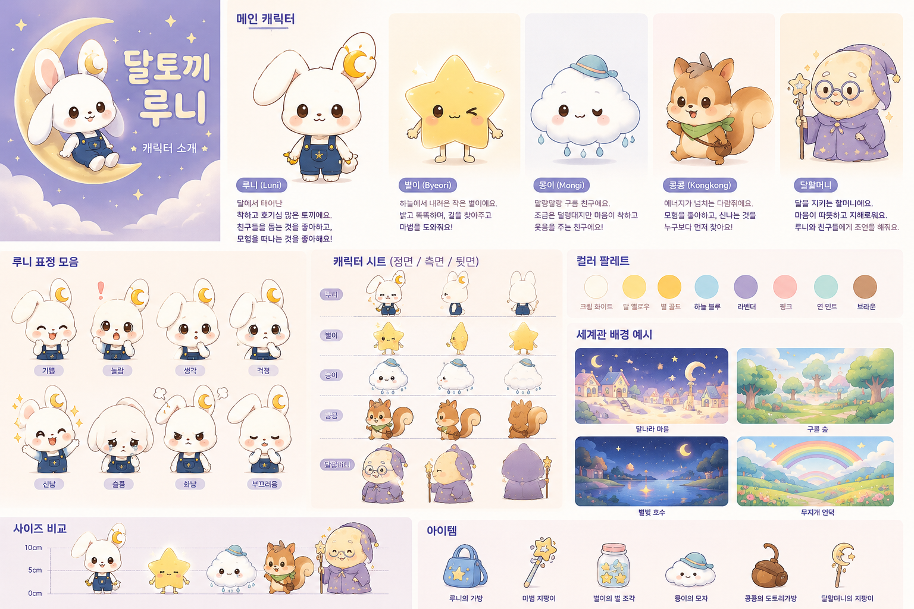

# 달토끼 루니 · Luni Studio

Projet GitHub d’une série animée **en coréen** pour les enfants de 3 à 7 ans.  
Les documents de pilotage sont rédigés en **français** pour faciliter la production.



## Langues du projet

- **Coréen** : titres, dialogues, chansons, narration et vidéos YouTube.
- **Français** : bible de production, consignes, organisation et documentation.
- Les noms coréens officiels restent toujours visibles pour garantir la cohérence de la marque.

## Contenu

- 8 personnages officiels et leur univers
- 100 idées d’épisodes uniques réparties en 4 saisons
- site adaptatif prêt pour GitHub Pages
- structure d’un épisode de 3 minutes
- modèle de scénario et prompts de génération visuelle

## Aperçu local

```powershell
py -m http.server 8000
```

Ouvrir ensuite `http://localhost:8000`.

## Publication sur GitHub Pages

1. Créer un nouveau dépôt GitHub.
2. Déposer tous les fichiers de ce dossier à la racine.
3. Ouvrir `Settings > Pages`.
4. Choisir `Deploy from a branch`, puis `main` et `/ (root)`.
5. Enregistrer et ouvrir l’adresse publique fournie par GitHub.

## Documents

- [Bible de production](docs/PRODUCTION_BIBLE.md)
- [Modèle d’épisode](docs/EPISODE_TEMPLATE.md)
- [Prompts visuels IA](docs/AI_PROMPTS.md)

## État du projet

Ce dépôt constitue un pack de préproduction. Les 100 épisodes possèdent un titre coréen, un thème éducatif et un synopsis. Avant la diffusion, chaque épisode devra recevoir un scénario coréen final, un storyboard, des voix, une musique et une validation adaptée aux contenus pour enfants.

© 2026 Luni Studio.
